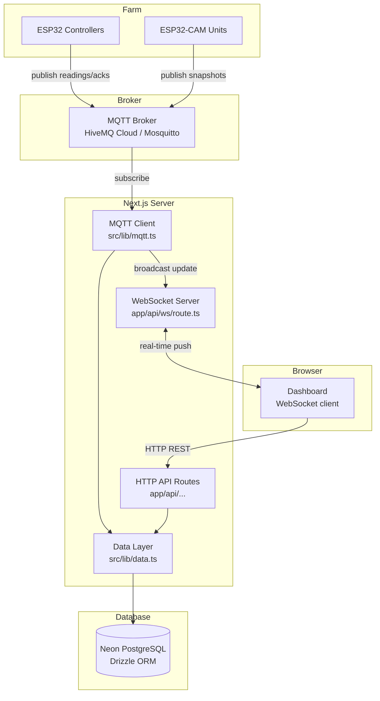
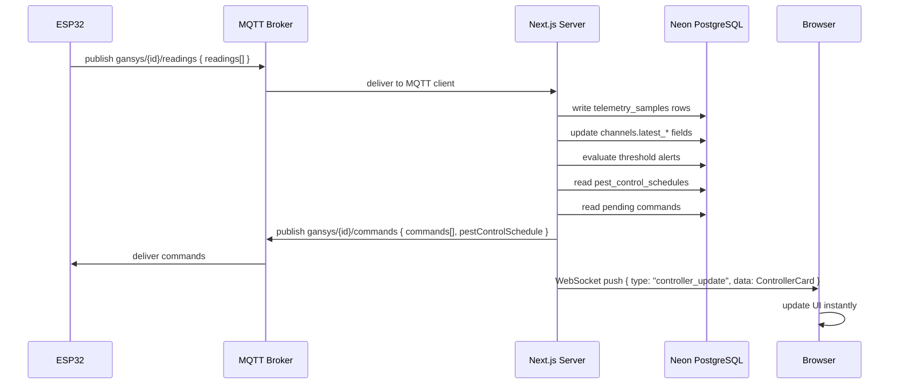
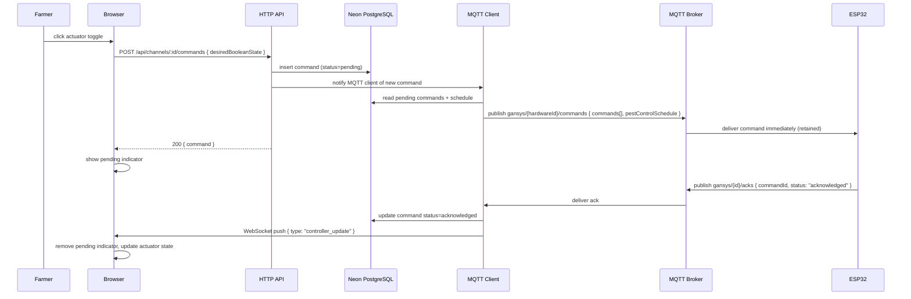
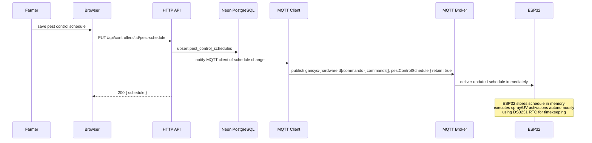

# Design Document: GanSystems Farm Monitoring Dashboard

## Overview

GanSystems is a production-grade farm monitoring and control dashboard. ESP32 microcontrollers and ESP32-CAM units deployed across the farm communicate with the server over **MQTT**. The browser dashboard receives real-time updates over **WebSocket**. All persistent data is stored in **Neon** (serverless PostgreSQL), accessed via Drizzle ORM.

This document covers the full system architecture including the pest control subsystem additions (`spray_pump`, `uv_zapper`, `camera_snapshot` channel templates, pest control schedule, and activity log).

---

## Communication Architecture

```
ESP32 / ESP32-CAM
      │
      │  MQTT (publish readings, acks)
      │  MQTT (subscribe commands, schedules)
      ▼
MQTT Broker (Mosquitto / HiveMQ Cloud)
      │
      │  MQTT client (mqtt npm package)
      ▼
Next.js Server  ──── Neon PostgreSQL (Drizzle ORM)
      │
      │  WebSocket (ws / Next.js API route)
      ▼
Browser Dashboard
      │
      │  HTTP REST (schedule config, manual commands,
      │             controller/channel management)
      ▼
Next.js API Routes
```

### Protocol Responsibilities

| Layer | Protocol | Direction | Purpose |
|---|---|---|---|
| ESP32 → Server | MQTT | Device → Broker → Server | Sensor readings, camera snapshots, command acks |
| Server → ESP32 | MQTT | Server → Broker → Device | Pending commands, pest control schedule |
| Browser → Server | HTTP REST | Browser → API | Save schedules, send manual commands, CRUD for controllers/channels |
| Server → Browser | WebSocket | Server → Browser | Real-time sensor updates, alert pushes, actuator state changes |
| Server ↔ DB | TCP (Neon serverless) | Server ↔ Neon | All persistent reads and writes |

### Why this split

- **MQTT for ESP32**: Designed for constrained IoT devices. Persistent connection, tiny packet overhead, QoS guarantees, built-in reconnect. Works on unreliable rural networks. The `mqtt` package is already in `package.json`.
- **WebSocket for browser**: Replaces 3–5 second HTTP polling. When a new MQTT reading arrives, the server immediately pushes it to all open browser sessions — farmers see live data without any delay.
- **HTTP REST for browser actions**: Request/response fits naturally for saving schedules, creating controllers, issuing manual commands. No need for a persistent connection for these.
- **Neon PostgreSQL**: Serverless Postgres with connection pooling built in. The `@neondatabase/serverless` driver uses HTTP for queries (no persistent TCP connection needed), which is ideal for Next.js serverless/edge functions. Scales automatically, no infrastructure to manage.

---

## System Architecture Diagram



---

## MQTT Topic Structure

All topics are namespaced under `gansys/` to avoid collisions on shared brokers.

| Topic | Publisher | Subscriber | Payload |
|---|---|---|---|
| `gansys/{hardwareId}/readings` | ESP32 | Server | `DeviceSyncRequest` JSON |
| `gansys/{hardwareId}/commands` | Server | ESP32 | `{ commands[], pestControlSchedule }` JSON |
| `gansys/{hardwareId}/acks` | ESP32 | Server | `{ acknowledgements[] }` JSON |
| `gansys/{hardwareId}/snapshot` | ESP32-CAM | Server | `{ channelKey, imageUrl?, imageBase64? }` JSON |

**QoS levels:**
- Readings: QoS 1 (at least once) — occasional duplicate is acceptable, missing a reading is not
- Commands: QoS 1 — command must reach the device
- Acks: QoS 1
- Snapshots: QoS 0 (fire and forget) — images are large; a missed frame is acceptable

**Retained messages:** The server publishes commands with `retain: true` so a device that reconnects after a power cycle immediately receives its pending commands and schedule without waiting for the next server-initiated publish.

### MQTT Client (`src/lib/mqtt.ts`)

A singleton MQTT client initialised once at server startup (Next.js custom server or a background worker). On receiving a message on `gansys/+/readings` or `gansys/+/acks`:

1. Parse the hardware ID from the topic
2. Look up the controller by `hardwareId` in Neon
3. Call `deviceSync(controller, payload)` in `src/lib/data.ts`
4. Publish the response (commands + schedule) back to `gansys/{hardwareId}/commands`
5. Broadcast the updated controller snapshot to all WebSocket clients subscribed to that controller

---

## WebSocket Server (`app/api/ws/route.ts`)

Uses the `ws` npm package via a Next.js custom server. Each browser connection sends an auth token on connect; the server validates the session and associates the socket with a `userId`.

**Message types (server → browser):**

```typescript
type WsMessage =
  | { type: "controller_update"; data: ControllerCard }
  | { type: "alert_opened";      data: AlertView }
  | { type: "alert_resolved";    data: { alertId: string } }
  | { type: "snapshot_update";   data: { channelId: string; snapshot: SnapshotPayload } }
  | { type: "pest_log_entry";    data: PestLogEntry };
```

The server maintains a `Map<userId, Set<WebSocket>>` so updates are broadcast only to the farm owner's open sessions.

**Browser client:** The existing polling intervals in `dashboard-home.tsx` (5s) and `controller-detail.tsx` (3s) are replaced with a WebSocket connection managed in a shared React context (`src/lib/ws-context.tsx`). HTTP polling is kept as a fallback if the WebSocket connection drops.

---

## Database: Neon PostgreSQL

### Driver and ORM

Replace `better-sqlite3` with `@neondatabase/serverless` + `drizzle-orm/neon-http`.

```typescript
// src/lib/db/client.ts
import { neon } from "@neondatabase/serverless";
import { drizzle } from "drizzle-orm/neon-http";
import * as schema from "@/lib/db/schema";

const sql = neon(process.env.DATABASE_URL!);
export const db = drizzle(sql, { schema });
```

`DATABASE_URL` is the Neon connection string (set in `.env.local` for dev, environment variable in production).

### drizzle.config.ts update

```typescript
export default {
  schema: "./src/lib/db/schema.ts",
  out: "./drizzle",
  dialect: "postgresql",
  dbCredentials: {
    url: process.env.DATABASE_URL!,
  },
} satisfies Config;
```

### Schema changes: SQLite → PostgreSQL

All `text` timestamp columns become `timestamp` with timezone. `integer` boolean columns become native `boolean`. JSON columns become `jsonb` for indexable, queryable JSON. The raw SQL migration script in `src/lib/db/migrations.ts` is replaced by Drizzle's `drizzle-kit generate` + `drizzle-kit migrate` workflow.

Key type mapping:

| SQLite | PostgreSQL (Drizzle) |
|---|---|
| `text("id").primaryKey()` | `text("id").primaryKey()` (unchanged) |
| `text("created_at")` | `timestamp("created_at", { withTimezone: true })` |
| `integer("boolean_state", { mode: "boolean" })` | `boolean("boolean_state")` |
| `text("config_json")` | `jsonb("config")` |
| `text("payload_json")` | `jsonb("payload")` |
| `real("numeric_value")` | `doublePrecision("numeric_value")` |

### Telemetry partitioning (scalability)

`telemetry_samples` is the highest-write table (every ESP32 sync writes N rows). For production scale, partition by month using PostgreSQL declarative partitioning:

```sql
CREATE TABLE telemetry_samples (
  ...
  recorded_at TIMESTAMPTZ NOT NULL
) PARTITION BY RANGE (recorded_at);

CREATE TABLE telemetry_samples_2025_01
  PARTITION OF telemetry_samples
  FOR VALUES FROM ('2025-01-01') TO ('2025-02-01');
-- etc. — new partitions created monthly via a cron job
```

Drizzle queries work unchanged against the parent table. Old partitions can be detached and archived to cold storage without downtime.

### New Table: `pest_control_schedules`

```typescript
export const pestControlSchedules = pgTable(
  "pest_control_schedules",
  {
    id: text("id").primaryKey(),
    controllerId: text("controller_id")
      .notNull()
      .references(() => controllers.id, { onDelete: "cascade" }),
    enabled: boolean("enabled").notNull().default(true),
    sprayEntries: jsonb("spray_entries")
      .$type<Array<{ startTime: string; durationMinutes: number }>>()
      .notNull()
      .default([]),
    uvStartTime: text("uv_start_time"),   // "HH:MM" or null
    uvEndTime: text("uv_end_time"),       // "HH:MM" or null
    updatedAt: timestamp("updated_at", { withTimezone: true }).notNull(),
  },
  (table) => [
    uniqueIndex("pest_schedules_controller_idx").on(table.controllerId),
  ]
);
```

One row per controller. `sprayEntries` uses native `jsonb` — no manual JSON serialisation needed. Upserted on every `PUT /api/controllers/:id/pest-schedule`.

---

## Data Flow Diagrams

### ESP32 Sensor Reading → Dashboard Update



### Manual Command: Farmer → ESP32



### Pest Control Schedule Delivery



---

## Components and Interfaces

### New Channel Templates (`src/lib/templates.ts`)

| Template | Kind | Unit | onLabel | offLabel | Notes |
|---|---|---|---|---|---|
| `spray_pump` | actuator | state | Spraying | Idle | display: toggle |
| `uv_zapper` | actuator | state | Active | Off | display: toggle |
| `camera_snapshot` | hybrid | image | — | — | display: image; rendered as standalone card |

`camera_snapshot` uses `kind: "hybrid"` so it is treated as a primary channel and excluded from the actuator toggle grouping logic in `getCardGroups`.

### New Setup Presets (`src/lib/templates.ts`)

`SetupPreset["id"]` union extended with `"pest_control"`.

**`pest_control` preset:**
```
channels: [
  { channelKey: "spray_pump", name: "Spray Pump", template: "spray_pump" },
  { channelKey: "uv_zapper",  name: "UV Zapper",  template: "uv_zapper"  },
]
```

**`full_gansystems` preset** — append after the existing battery channel:
```
{ channelKey: "spray_pump", name: "Spray Pump", template: "spray_pump" },
{ channelKey: "uv_zapper",  name: "UV Zapper",  template: "uv_zapper"  },
```

### New API Routes

#### `GET /api/controllers/[id]/pest-schedule`

Returns the current schedule or `{ schedule: null }` if none configured.

#### `PUT /api/controllers/[id]/pest-schedule`

Validates and upserts the schedule. Triggers an MQTT publish of the updated commands+schedule to the device.

Validation:
- `startTime` / `uvStartTime` / `uvEndTime`: `/^\d{2}:\d{2}$/`, hours 0–23, minutes 0–59
- `durationMinutes`: integer 1–120
- `sprayEntries`: 0–10 entries
- `enabled`: boolean

#### Modified: `POST /api/device/sync` (HTTP fallback)

Kept as a fallback for deep-sleep ESP32s that cannot maintain a persistent MQTT connection. Response shape unchanged but gains `pestControlSchedule`:

```typescript
type SyncResponse = {
  commands: PendingCommand[];
  pestControlSchedule: PestControlSchedulePayload | null;
};
```

### New UI Sections (`src/components/dashboard/controller-detail.tsx`)

#### WebSocket Context (`src/lib/ws-context.tsx`)

```typescript
const WsContext = createContext<{
  subscribe: (controllerId: string) => void;
  unsubscribe: (controllerId: string) => void;
  lastMessage: WsMessage | null;
}>(...)
```

`ControllerDetail` and `DashboardHome` subscribe to their controller IDs on mount. Incoming `controller_update` messages replace the local snapshot state, eliminating polling.

#### Camera Snapshot Card

```
┌─────────────────────────────────────┐
│ camera snapshot          [hybrid]   │
│ Weed Camera                         │
│ ┌─────────────────────────────────┐ │
│ │           │ │
│ │  or "No snapshot yet"           │ │
│ └─────────────────────────────────┘ │
│ Channel key: weed_cam / Updated 2m  │
└─────────────────────────────────────┘
```

Image source from `latestSnapshots[channelId]` in the `ControllerSnapshot` response.

#### Pest Control Schedule Panel

```
┌─────────────────────────────────────┐
│ Pest Control Schedule               │
│ [x] Enabled                         │
│                                     │
│ Spray Time Slots                    │
│  06:00  15 min  [Remove]            │
│  18:00  10 min  [Remove]            │
│  [+ Add Slot]                       │
│                                     │
│ UV Zapper Window                    │
│  Start: 20:00   End: 05:00          │
│                                     │
│ [Save Schedule]                     │
└─────────────────────────────────────┘
```

Shown only when controller has at least one `spray_pump` or `uv_zapper` channel.

#### Pest Control Activity Log Panel

```
┌─────────────────────────────────────┐
│ Pest Control Activity               │
│                                     │
│ Spray Pump  scheduled  On   2m ago  │
│ UV Zapper   manual     Off  5m ago  │
│ ...                                 │
│ (or "No activity yet")              │
└─────────────────────────────────────┘
```

Updated in real time via WebSocket `pest_log_entry` messages.

---

## Type Extensions (`src/lib/types.ts`)

```typescript
export type SprayEntry = {
  startTime: string;       // "HH:MM"
  durationMinutes: number; // 1–120
};

export type PestControlSchedule = {
  controllerId: string;
  enabled: boolean;
  sprayEntries: SprayEntry[];
  uvStartTime: string | null;
  uvEndTime: string | null;
  updatedAt: string;
};

export type SnapshotPayload = {
  imageUrl: string | null;
  imageBase64: string | null;
};

export type PestLogEntry = {
  channelId: string;
  channelName: string;
  activationType: "manual" | "scheduled";
  booleanState: boolean;
  recordedAt: string;
};

export type WsMessage =
  | { type: "controller_update"; data: ControllerCard }
  | { type: "alert_opened";      data: AlertView }
  | { type: "alert_resolved";    data: { alertId: string } }
  | { type: "snapshot_update";   data: { channelId: string; snapshot: SnapshotPayload } }
  | { type: "pest_log_entry";    data: PestLogEntry };

// ControllerSnapshot extended:
export type ControllerSnapshot = {
  user: SessionUser;
  controller: ControllerCard;
  alerts: AlertView[];
  commands: CommandView[];
  pestSchedule: PestControlSchedule | null;
  pestLog: PestLogEntry[];
  latestSnapshots: Record<string, SnapshotPayload>;
};
```

---

## Updated `ChannelTemplateId` and `SetupPreset` unions

```typescript
export type ChannelTemplateId =
  | "tank_level" | "soil_moisture" | "turbidity" | "fish_tank_level"
  | "pump" | "irrigation_valve" | "flush_valve" | "inlet_valve"
  | "battery_voltage"
  | "spray_pump"        // NEW
  | "uv_zapper"         // NEW
  | "camera_snapshot"   // NEW
  | "custom";

export type SetupPreset = {
  id: "custom" | "tank_automation" | "irrigation_zone" | "aquaculture_tank"
    | "full_gansystems"
    | "pest_control";   // NEW
  ...
};
```

---

## Dependency Changes

| Package | Action | Reason |
|---|---|---|
| `better-sqlite3` | Remove | Replaced by Neon |
| `@types/better-sqlite3` | Remove | No longer needed |
| `@neondatabase/serverless` | Add | Neon HTTP driver |
| `drizzle-orm` | Keep (update dialect) | ORM unchanged, dialect switches to `neon-http` |
| `ws` | Add | WebSocket server |
| `@types/ws` | Add | TypeScript types for ws |
| `mqtt` | Keep | Already present, used for MQTT client |

---

## Correctness Properties

### Property 1: Controller status classification is exhaustive and correct

*For any* `lastSeenAt` timestamp and `heartbeatIntervalSec` value, `computeControllerStatus` SHALL return exactly one of `"online"`, `"stale"`, or `"offline"`, matching: online ≤ interval, stale ≤ 2×interval, offline > 2×interval.

**Validates: Requirements 1.3, 1.4**

### Property 2: Dashboard summary counts are consistent with input data

*For any* array of `ControllerCard` and `AlertView` objects, `buildSummary` SHALL return counts and averages that exactly match the input data.

**Validates: Requirements 1.1**

### Property 3: Alert ordering is severity-first then time-descending

*For any* list of `AlertView` objects, the sorted output SHALL place critical before warning before info, and within each group order by `openedAt` descending.

**Validates: Requirements 1.6**

### Property 4: Camera snapshot payload round-trip

*For any* sync payload with a `camera_snapshot` reading containing `imageUrl` or `imageBase64`, after processing the most recent telemetry row for that channel SHALL contain the same image data.

**Validates: Requirements 4.2**

### Property 5: Pest control schedule round-trip

*For any* valid `PestControlSchedule`, saving then reading it back SHALL return a deeply equal schedule.

**Validates: Requirements 8.4, 8.7**

### Property 6: Schedule replacement is total

*For any* two valid schedules A then B, after saving B, `getPestSchedule` SHALL return B with no data from A.

**Validates: Requirements 8.7**

### Property 7: Sync response always contains pestControlSchedule field

*For any* valid sync request from a registered controller, the response SHALL always contain a `pestControlSchedule` key (value is the saved schedule or `null`).

**Validates: Requirements 8.5, 8.6**

### Property 8: Pest control log returns at most 20 entries ordered by time

*For any* controller with more than 20 pest control telemetry samples, `getPestControlLog` SHALL return exactly 20 entries ordered by `recordedAt` descending.

**Validates: Requirements 9.2, 9.3**

### Property 9: Preset channel keys are unique within a controller

*For any* controller state and preset, `buildPresetChannels` SHALL return channels with keys distinct from each other and from all existing keys on that controller.

**Validates: Requirements 10.2**

### Property 10: Sync response commands are ordered oldest-first

*For any* controller with multiple pending commands, the `commands` array SHALL be ordered by `createdAt` ascending.

**Validates: Requirements 11.2**

### Property 11: Threshold alerts are raised and resolved correctly

*For any* channel with thresholds, a reading below `thresholdLow` or above `thresholdHigh` SHALL open a critical alert, and a subsequent reading within warning bounds SHALL resolve it.

**Validates: Requirements 13.1, 13.2, 13.3**

### Property 12: Invalid device credentials always return 401

*For any* MQTT or HTTP sync request with an unrecognised hardware ID or invalid device key, the server SHALL reject it and SHALL NOT write any telemetry or update any channel state.

**Validates: Requirements 11.6**

---

## Error Handling

| Scenario | Behaviour |
|---|---|
| `PUT /pest-schedule` with invalid time format | 400 `{ error: "Invalid time format. Use HH:MM." }` |
| `PUT` with `durationMinutes` outside 1–120 | 400 `{ error: "Duration must be between 1 and 120 minutes." }` |
| `PUT` with more than 10 spray entries | 400 `{ error: "Maximum 10 spray entries allowed." }` |
| `GET/PUT /pest-schedule` for unowned controller | 404 |
| MQTT message with unknown hardware ID | Silently dropped; warning logged server-side |
| `camera_snapshot` with `imageBase64` > 2 MB | Reading stored with empty payload; warning alert raised |
| Schedule fetch fails during MQTT processing | Commands published without schedule; `pestControlSchedule: null`; error logged |
| Neon connection timeout | 503 returned to browser; MQTT processing retried once after 2s |
| WebSocket client disconnects | Removed from broadcast map; reconnects automatically via browser client |

---

## Testing Strategy

### Unit Tests

- `computeControllerStatus` at boundary timestamps (exactly 1× and 2× interval)
- `buildSummary` with empty list, all-offline, mixed severities
- `getCardGroups` excludes `camera_snapshot` from groups and standaloneActuators
- `getCardGroups` places unlinked `spray_pump`/`uv_zapper` in standaloneActuators
- `CHANNEL_TEMPLATES` contains all three new templates with correct fields
- `CONTROLLER_SETUP_PRESETS` contains `pest_control` preset
- `full_gansystems` preset includes `spray_pump` and `uv_zapper`
- Schedule GET returns `null` when no schedule exists
- Schedule GET returns saved schedule after PUT
- MQTT topic parser extracts correct hardware ID from topic string

### Property-Based Tests (fast-check + Vitest)

Each property runs minimum 100 iterations. Tag: `// Feature: pest-control-subsystem, Property N`

| Property | Generator | Assertion |
|---|---|---|
| P1: Status classification | interval: `fc.integer(15,300)`, lastSeenAt: `fc.date()` | Matches age-based rule |
| P2: Summary consistency | `fc.array(controllerCardArb)`, `fc.array(alertArb)` | Counts and averages match |
| P3: Alert ordering | `fc.array(alertArb)` | Severity-first, time-descending |
| P4: Snapshot round-trip | `fc.oneof(imageUrlArb, imageBase64Arb)` | payloadJson contains submitted data |
| P5: Schedule round-trip | `fc.record(scheduleArb)` | GET after PUT returns equal schedule |
| P6: Schedule replacement | Two independent `scheduleArb` | Second save fully overwrites first |
| P7: Sync always has pestControlSchedule | `fc.record(syncBodyArb)` | Response always has the key |
| P8: Log limit and order | `fc.array(telemetrySampleArb, { minLength: 21 })` | ≤20 entries, ordered desc |
| P9: Preset key uniqueness | `fc.array(fc.string())` for existing keys | All generated keys unique |
| P10: Commands oldest-first | `fc.array(commandArb, { minLength: 2 })` | Ordered by createdAt asc |
| P11: Threshold alert lifecycle | `fc.record(channelWithThresholdsArb)` + readings | Alert raised then resolved |
| P12: Invalid credentials → rejected | `fc.string()` for ID and key | No DB writes, request rejected |
